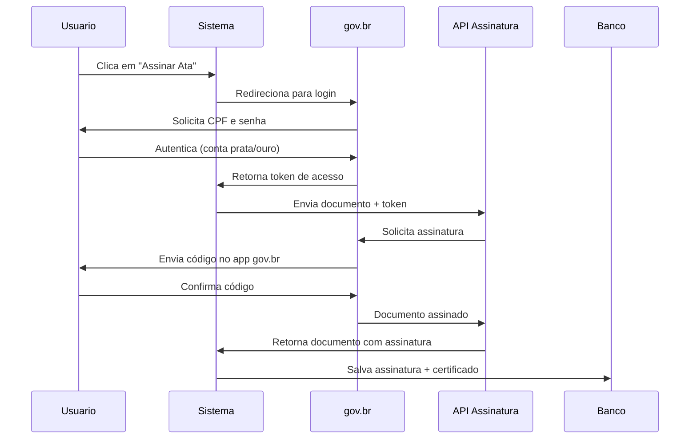

# 📝 Sistema de Assinatura de Atas

## Visão Geral

O sistema permite que múltiplas pessoas assinem digitalmente as atas de reunião geradas, criando um registro auditável de quem aprovou o documento.

## Funcionalidades Implementadas

### ✅ Assinatura Simples (Atual)
- Registro de assinaturas com dados do assinante
- Nome completo (obrigatório)
- CPF (opcional)
- E-mail (opcional)
- Cargo no condomínio (opcional)
- Hash SHA-256 do documento no momento da assinatura
- Registro de IP e User Agent para auditoria
- Timestamp da assinatura

### 📋 Informações Registradas
Cada assinatura armazena:
- **Dados do Assinante**: Nome, CPF, e-mail, cargo
- **Dados Técnicos**: Hash do documento, IP, User Agent
- **Metadados**: Data/hora da assinatura, tipo de assinatura
- **Relacionamento**: Vinculada ao arquivo/ata específico

### 🎨 Interface do Usuário
- Botão "✍️ Assinar Ata" na página de visualização
- Modal com formulário de assinatura
- Lista de todas as assinaturas já registradas
- Informações visuais sobre cada assinante
- Impressão incluindo assinaturas

## Endpoints da API

### POST `/api/audio/:id/assinar`
Cria uma nova assinatura para a ata.

**Body:**
```json
{
  "nomeAssinante": "João Silva",
  "cpfAssinante": "123.456.789-00",
  "emailAssinante": "joao@email.com",
  "cargoAssinante": "Síndico"
}
```

**Response:**
```json
{
  "success": true,
  "message": "Assinatura registrada com sucesso",
  "data": {
    "id": "uuid",
    "nomeAssinante": "João Silva",
    "cargoAssinante": "Síndico",
    "assinadoEm": "2025-12-01T05:41:47.000Z",
    "tipoAssinatura": "SIMPLES"
  }
}
```

### GET `/api/audio/:id/assinaturas`
Lista todas as assinaturas de uma ata.

**Response:**
```json
{
  "success": true,
  "data": [
    {
      "id": "uuid",
      "nomeAssinante": "João Silva",
      "cargoAssinante": "Síndico",
      "cpfAssinante": "123.456.789-00",
      "emailAssinante": "joao@email.com",
      "tipoAssinatura": "SIMPLES",
      "hashDocumento": "sha256...",
      "assinadoEm": "2025-12-01T05:41:47.000Z"
    }
  ]
}
```

## Banco de Dados

### Modelo `Assinatura`
```prisma
model Assinatura {
  id                   String   @id @default(uuid())
  arquivoAudioId       String
  arquivoAudio         ArquivoAudio @relation(fields: [arquivoAudioId], references: [id], onDelete: Cascade)
  
  // Dados do assinante
  nomeAssinante        String
  cpfAssinante         String?
  emailAssinante       String?
  cargoAssinante       String?
  
  // Dados da assinatura
  tipoAssinatura       String   @default("SIMPLES")
  hashDocumento        String?
  ipAssinante          String?
  userAgentAssinante   String?
  
  // Integração gov.br (futuro)
  govbrCpf             String?
  govbrNivelConta      String?
  govbrCertificadoId   String?
  
  assinadoEm           DateTime @default(now())
  
  @@map("assinaturas")
}
```

## Tipos de Assinatura

### 1. SIMPLES (Atual) ✅
- Assinatura eletrônica simples
- Para controle interno do condomínio
- Não possui validade jurídica formal
- Suficiente para atas de reuniões ordinárias

### 2. GOVBR (Futuro) 🔜
- Integração com gov.br
- Requer conta gov.br nível prata ou ouro
- Certificado digital emitido automaticamente
- Validade jurídica reconhecida

### 3. CERTIFICADO_DIGITAL (Futuro) 🔜
- Integração com certificados ICP-Brasil
- Maior nível de segurança
- Validade jurídica total
- Para documentos críticos

## Integração com gov.br

### Requisitos para Implementação Futura

A integração oficial com a Plataforma de Assinatura GOV.BR requer:

1. **Solicitação Formal**
   - Acesso ao [Portal de Serviços](https://www.gov.br/governodigital/pt-br/estrategias-e-governanca-digital/transformacao-digital/servico-de-integracao-aos-produtos-de-identidade-digital-gov.br)
   - Preenchimento do formulário de integração
   - Formalização por agente público (limitação atual)

2. **Pré-requisitos Técnicos**
   - Integração com Login Único (Conta GOV.BR)
   - OAuth 2.0 / OpenID Connect
   - Implementação da API de Assinatura
   - Validação de certificados

3. **Documentação Técnica**
   - [Manual de Integração - Assinatura](https://manual-integracao-assinatura-eletronica.servicos.gov.br/pt_BR/latest/)
   - [Manual de Integração - Login Único](https://manual-roteiro-integracao-login-unico.servicos.gov.br/pt/stable/iniciarintegracao.html)

4. **Limitação Atual**
   - Sistema é para condomínios (entidades privadas)
   - gov.br é voltado para órgãos públicos
   - Alternativa: usar como referência para implementação própria

### Fluxo de Assinatura gov.br (Quando Implementado)



## Segurança

### Medidas Implementadas
- ✅ Hash SHA-256 do documento no momento da assinatura
- ✅ Registro de IP do assinante
- ✅ Registro de User Agent
- ✅ Timestamp imutável da assinatura
- ✅ Validação de ata existente antes de assinar
- ✅ Cascade delete (assinaturas deletadas com o arquivo)

### Auditoria
Todas as assinaturas ficam registradas permanentemente com:
- Quem assinou (nome, cargo, contato)
- Quando assinou (timestamp)
- De onde assinou (IP, device)
- O que foi assinado (hash do documento)

### Verificação de Integridade
O hash SHA-256 permite verificar se o documento foi alterado após a assinatura:
```javascript
// Exemplo de verificação
const crypto = require('crypto');
const hashAtual = crypto.createHash('sha256').update(textoAta).digest('hex');
if (hashAtual === assinatura.hashDocumento) {
  console.log('✅ Documento íntegro');
} else {
  console.log('⚠️ Documento foi modificado após assinatura');
}
```

## Casos de Uso

### 1. Reunião Ordinária
- Secretário gera ata da reunião
- Síndico revisa e assina
- Conselheiros assinam para aprovar
- Todos os presentes podem assinar

### 2. Reunião Extraordinária
- Assunto urgente requer aprovação formal
- Assinatura digital agiliza o processo
- Não precisa reunir presencialmente para assinar
- Histórico completo de aprovações

### 3. Auditoria
- Verificar quem aprovou cada decisão
- Rastrear timeline de assinaturas
- Validar integridade dos documentos
- Comprovar participação nas reuniões

## Como Usar

### Para Usuários

1. **Visualizar Ata**
   - Acesse a página da ata desejada
   - Leia o conteúdo completo

2. **Assinar**
   - Clique em "✍️ Assinar Ata"
   - Preencha seus dados:
     - Nome completo (obrigatório)
     - Cargo no condomínio (recomendado)
     - CPF e e-mail (opcional)
   - Clique em "✍️ Assinar Ata"

3. **Verificar Assinaturas**
   - Role até o final da ata
   - Veja a lista de todas as assinaturas
   - Confirme quem já assinou

### Para Desenvolvedores

1. **Adicionar Nova Assinatura**
```javascript
const response = await audioService.assinar(ataId, {
  nomeAssinante: "Maria Santos",
  cpfAssinante: "987.654.321-00",
  emailAssinante: "maria@email.com",
  cargoAssinante: "Conselheira"
});
```

2. **Listar Assinaturas**
```javascript
const response = await audioService.getAssinaturas(ataId);
const assinaturas = response.data.data;
```

3. **Verificar se Ata Foi Assinada**
```javascript
const arquivo = await prisma.arquivoAudio.findUnique({
  where: { id: ataId },
  include: { assinaturas: true }
});

if (arquivo.assinaturas.length > 0) {
  console.log(`Ata possui ${arquivo.assinaturas.length} assinatura(s)`);
}
```

## Melhorias Futuras

### Curto Prazo
- [ ] Notificação por e-mail quando ata for assinada
- [ ] Validação de formato de CPF
- [ ] Download de ata com lista de assinaturas em PDF
- [ ] Permitir adicionar observações na assinatura

### Médio Prazo
- [ ] Integração com Login Único gov.br
- [ ] Suporte a múltiplos tipos de assinatura
- [ ] Dashboard de assinaturas pendentes
- [ ] Lembretes automáticos para assinar

### Longo Prazo
- [ ] Integração completa com gov.br (se houver abertura para privados)
- [ ] Suporte a certificado digital ICP-Brasil
- [ ] Assinatura com reconhecimento biométrico
- [ ] Blockchain para registro imutável

## Conformidade Legal

### Lei nº 14.063/2020
Dispõe sobre o uso de assinaturas eletrônicas:
- **Assinatura Eletrônica Simples**: dados anexados/associados (implementado)
- **Assinatura Eletrônica Avançada**: certificação não ICP-Brasil (futuro)
- **Assinatura Qualificada**: certificação ICP-Brasil (futuro)

### Decreto nº 10.543/2020
Regulamenta níveis de assinatura na administração pública.

**Nota**: Para condomínios (entidades privadas), a validade jurídica depende:
- Convenção do condomínio
- Regimento interno
- Aceitação em assembleia
- Boa prática: adicionar cláusula aprovando assinatura eletrônica

## Suporte e Contato

Para dúvidas sobre implementação:
- 📧 E-mail: [seu contato]
- 📚 Documentação: `/docs/`
- 🐛 Issues: GitHub

## Referências

- [gov.br - Assinatura Eletrônica](https://www.gov.br/governodigital/pt-br/assinatura-eletronica)
- [Lei nº 14.063/2020](http://www.planalto.gov.br/ccivil_03/_ato2019-2022/2020/lei/L14063.htm)
- [Decreto nº 10.543/2020](http://www.planalto.gov.br/ccivil_03/_ato2019-2022/2020/decreto/D10543.htm)
- [Manual de Integração - Assinatura gov.br](https://manual-integracao-assinatura-eletronica.servicos.gov.br/pt_BR/latest/)
